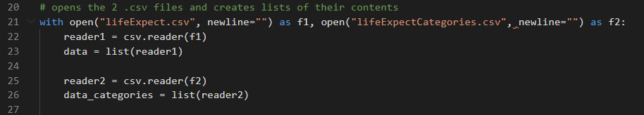

# Life Expectancy statistics 

[Link to the live project deployed on Heroku](https://life-expectancy-ms3.herokuapp.com/)

A simple command line Python application which reads a given .csv file containing data such as life expectancy, GPD, infection and immunisation rates for various diseases and other statistics for 167 countries in 2015. The program parses the file and displays the top and bottom five countries in the selected category to the user. Although only one is used, the program will in theory work with any .csv file in the correct format.

The repository includes two .csv files: lifeExpect.csv, which contains all of the data to be sorted, and lifeExpectCategories.csv, which describes each of the categories in more detail.

## Features

- ### Retrieves user input

The first screen the user is greeted with when they run the program for the first time is a list of each of the thirteen columns of the .csv file which prompts them to select a category of data they wish to sort.

The first version of the code for this output was a separate print statement for each line which was cumbersome and inelegant. I later refactored the code to use a for loop to pull the strings from the .csv line and print each line.

- ### Reads .csv files

The program features a .csv reader to parse the two .csv files and extract specific elements in order to sort them. This part of the program creates two variables, data and data_categories, which are lists containing the contents of each .csv file. Other parts of the program will reference specific indices of these lists to retrieve data from them as required.

- ### Validates user input

- ### Object oriented programming

- ### Data sorting algorithm

- ### Restart application

- ### Future features to be implemented

## Deployment

## Testing

### Bugs identified and fixed:

### Validator testing

### Improvements to make

## Credits

### Acknowledgements

Spencer Barriball for his invaluable feedback and advice.

### Technology used

### Resources

- [W3Schools](https://www.w3schools.com/)