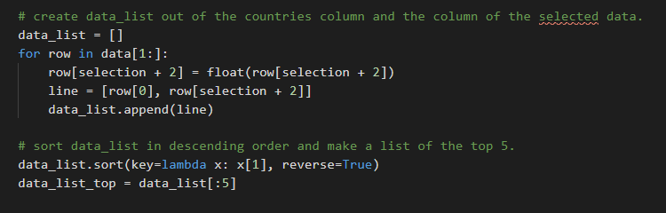

# Life Expectancy statistics 

[Link to the live project deployed on Heroku](https://life-expectancy-ms3.herokuapp.com/)

 A simple command line Python application which reads a given .csv file containing data such as life expectancy, GPD, infection and immunisation rates for various diseases and other statistics for 167 countries in 2015. The program parses the file and displays the top and bottom five countries in the selected category to the user. Although only one is used, the program will in theory work with any .csv file in the correct format.

The repository includes two .csv files: lifeExpect.csv, which contains all of the data to be sorted, and lifeExpectCategories.csv, which describes each of the categories in more detail.

Flowchart of the program's logic

## Features

- ### Retrieves user input

    The first screen the user is greeted with when they run the program for the first time is a list of each of the thirteen columns of the .csv file which prompts them to select a category of data they wish to sort.

The first version of the code for this output was a separate print statement for each line which was cumbersome and inelegant. I later refactored the code to use a for loop to pull the strings from the .csv line and print each line.

- ### Reads .csv files

    The program features a .csv reader to parse the two .csv files and extract specific elements in order to sort them. This part of the program creates two variables, data and data_categories, which are lists containing the contents of each .csv file. Other parts of the program will reference specific indices of these lists to retrieve data from them as required.

- ### Validates user input

    
Once the user has entered a number to select which category they wish to sort, the validate_input function is called, using the user input as an argument. The function checks that the user input is an integer between 1 and 13 and if it isn't it repeats the while loop which asks the user for input again.

- ### Object oriented programming

    After the user input has been successfully validated, the define_object function is called which creates an instance of the Data_category class, defined at the beginning of the program. The class has two properties, name and info.

    Name is the name of the category selected by the user, pulled from the data list using the user input from earlier to locate the correct index. Info is the string from the second .csv file which explains the selected category in more detail. 

The function prints out the name and info properties of the new instance to help the user understand the data that will be shown below. The output from the object is highlighted in yellow in the screenshot below.

- ### Data sorting algorithm

    The sort_data function creates a new list, data_list, which is made up of the column of country names and column selected by the user. This new list is then sorted by the second column and all but the top five items are removed to create the top and bottom five in the selected category, which is then displayed to the user.

- ### Restart application

    Finally, the user is prompted to enter Y or N to indicate if they wish to sort another data set. Entering an upper or lower case Y will call the main function, restarting the program, likewise an upper or lower case N will exit the restart function, ending the program. Any other input will call the restart function again

## Deployment

## Testing

### Bugs identified and fixed:

### Validator testing

### Improvements to make

## Credits

### Acknowledgements

Spencer Barriball for his invaluable feedback and advice.

### Technology used

### Resources

- [W3Schools](https://www.w3schools.com/)